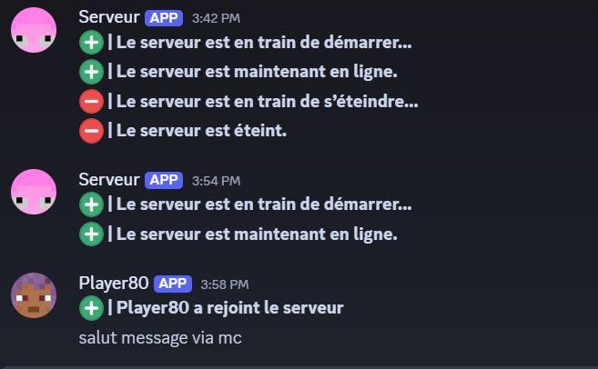

# DiscordChat (Minecraft Forge 1.12.2 Mod)

**DiscordChat** est un mod Minecraft Forge 1.12.2 permettant de connecter un serveur Minecraft à un serveur Discord. Il synchronise les messages du chat Minecraft vers Discord, et vice-versa, tout en permettant des commandes avancées via Minecraft pour configurer le bot Discord.

---

## 🚀 Fonctionnalités principales

* Affichage des messages Discord directement dans le chat Minecraft.
* Transfert des messages Minecraft vers un webhook Discord.
* Notifications automatiques lors du démarrage, de l'arrêt ou du redémarrage du serveur.
* Commandes en jeu pour configurer le bot et recharger la configuration.
* Mode maintenance pour signaler un état temporaire du serveur.
* Notification d'arrivée et de départ des joueurs sur Discord avec avatar.

---

## 📦 Installation

1. Assurez-vous d'avoir Forge 1.12.2 installé sur votre serveur Minecraft.
2. Placez le mod `discordchat.jar` dans le dossier `mods`.
3. Lancez une première fois le serveur pour générer le fichier de configuration `config/discordchat.cfg`.
4. Editez `discordchat.cfg` avec vos informations Discord :

```ini
[Discord]
    Webhook=<votre_webhook>
    Token=<votre_token_bot>
    ChannelID=<id_du_canal_texte>
    ServerID=<id_du_serveur_discord>
```

5. Redémarrez le serveur Minecraft.

---

## 🔧 Installation du projet ChatDiscord (Mod Minecraft)

Vous pouvez naviguer dans le projet directement sur GitHub, ou bien le télécharger en tant que fichier ZIP et l’explorer localement.

### ✅ Étapes d'installation pour les débutants :

1. **Téléchargez le projet au format ZIP.**
2. **Décompressez-le** dans un dossier approprié de votre ordinateur (par exemple dans `Documents`).
   (Ou, si vous savez comment *forker* un projet GitHub et le cloner dans un dépôt local Git, vous pouvez aussi procéder ainsi.)
3. Ouvrez une invite de commande dans le dossier du projet, puis exécutez la commande suivante :

```bash
gradlew setupDecompWorkspace
```

Cela installera Forge et configurera le projet. **Ce processus peut durer 20 minutes ou plus.**

4. Si vous utilisez un IDE comme **IntelliJ IDEA** ou **Eclipse**, configurez-le à l’aide de la ligne de commande :

   * Pour IntelliJ IDEA :

```bash
gradlew idea
```

* Pour Eclipse :

```bash
gradlew eclipse
```

### 📁 Utilisation avec IntelliJ IDEA

1. Ouvrez le projet (fichier `ChatDiscord.ipr`).
2. Il vous sera demandé si vous souhaitez importer le projet Gradle non lié. **Ce n’est pas obligatoire.**

   * Si vous répondez *non*, vous devrez compiler le mod plus tard avec :

```bash
gradlew build
```

* Si vous répondez *oui*, vous pourrez utiliser les tâches Gradle directement depuis IntelliJ.

3. Si vous avez importé le projet Gradle, exécutez ensuite la tâche suivante pour générer les configurations de lancement et de débogage :

```bash
gradlew genIntellijRuns
```

### 📁 Utilisation avec Eclipse

1. Ouvrez le projet.
2. Clic droit sur le projet > "Run As" > "Run Configurations..."
3. Définissez la classe principale sur :

```
GradleStart
```

4. Vous pouvez maintenant démarrer Minecraft avec le mod chargé (via Run ou Debug).

### ⚡ Sans IDE (en ligne de commande uniquement)

* Pour compiler le projet :

```bash
gradlew build
```

* Pour exécuter Minecraft avec le mod :

```bash
gradlew runClient
```

### 🌟 Utilisation du mod dans Minecraft

Pour utiliser le mod dans une installation Minecraft indépendante :

1. Exécutez la commande suivante pour le recompiler avec les bons noms de méthodes :

```bash
gradlew reobf
```

2. Copiez ensuite le fichier JAR généré dans le dossier `mods` de votre Minecraft :

```
build/libs/chatdiscord-1.12.2a.jar
```

3. Lancez Minecraft et le mod **ChatDiscord** sera chargé !

> ℹ️ **Astuce** : l’utilisation d’un IDE est vivement recommandée pour faciliter le développement et le débogage, mais ce n’est pas obligatoire.

---

## ⚙️ Commandes disponibles (in-game)

Toutes les commandes doivent être effectuées par un OP (/chatdiscord):

```bash
/chatdiscord reloadconfig      # Recharge la configuration et redémarre le bot
/chatdiscord showconfig        # Affiche la config actuelle
/chatdiscord maintenancemode   # Active/désactive le mode maintenance
/chatdiscord setwebhook <url> # Définit l'URL du webhook Discord
/chatdiscord settoken <token> # Définit le token du bot Discord
/chatdiscord setchannelid <id># Définit l'ID du canal texte Discord
/chatdiscord setserverid <id> # Définit l'ID du serveur Discord
```

---

## 🧪 Intégration Discord

* Le bot lit les messages du canal spécifié et les renvoie en jeu.
* Le message `!tps` dans Discord permet d'afficher le TPS du serveur Minecraft.
* Les messages provenant de Discord sont affichés dans Minecraft avec le préfixe `[DISCORD]`.

---

## 🛡️ Permissions

Seuls les joueurs avec le niveau de permission OP peuvent utiliser les commandes `/chatdiscord`.

---

## 📁 Structure du projet

* `DiscordChat.java` : Point d'entrée du mod
* `StartBot.java` : Démarre et gère le bot Discord (via JDA)
* `WebHookSender.java` : Envoie les messages Minecraft vers Discord via webhook
* `PlayerJoinLeaveListener.java` : Notifications d'entrée/sortie des joueurs
* `ChatReceiver.java` : Capture les messages du chat Minecraft
* `ServerStatusNotifier.java` : Notifications d'état du serveur
* `CommandChatDiscord.java` : Commande en jeu de configuration
* `ConfigManager.java` : Chargement et sauvegarde de la configuration

---

## 🚫 Limitations / TODO

* Non testé sur des versions Forge différentes de 1.12.2 (sera porté prochainement)
* Pas de filtrage anti-spam ou modération automatique pour l'instant
* Pas encore de configs pour les messages, traduction, emoji utilisé
 
---

## 🚧 Dépendances

* [Minecraft Forge 1.12.2](https://files.minecraftforge.net)
* [JDA (Java Discord API)](https://github.com/DV8FromTheWorld/JDA)

---

## 🌟 Auteurs

Projet développé par **Simon**. Contributions bienvenues !

---

## ✅ Licence

Ce projet est distribué sous licence **MIT**.

---

## 📢 Screenshots 



---

## 🙏 Remerciements

* Forge pour l'API
* DV8FromTheWorld pour la JDA
* Minotar pour les avatars Minecraft
